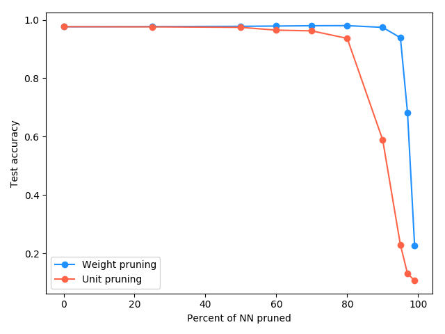

Investigating the effect of pruning a neural network
=========================================

Overview
-----------------------

After training, a vanilla, fully connected neural network (NN) has some weights that are less vital to the performance than others. Ideally, if those weights could be identified and removed without damaging performance too much, the NN could be made to require less memory and run more quickly. This is called "pruning".

There are two simple ways to prune: weight pruning and unit pruning. In weight pruning, we set individual weights of the weight matrix to zero. For unit pruning, we set an entire column to zero, meaning a whole output neuron will be disconnected.

For both, we make a simplifying assumption that guides the choice of which weights/units to prune: we remove the smallest (in magnitude) first. This intuitively makes sense because if a weight is zero, it can't contribute to the output. So the closer a weight (or column) is to zero, we assume that it's less likely to be important (see more below). Here, we don't prune the weights of the final output layer.

Method
-----------------------

Here's a quick overview of what's done here. The main script is `prune_NN.py`.

The MNIST dataset is used. It's divided into train and test sets, and the image data is scaled to be in a more reasonable input range.

For the model, we have an input layer that flattens the 28px by 28px image matrix into a flat array (this layer has no weights). Then, we add these layers in order, which are all fully connected and have `use_bias=False` so they don't have biases:
* 1000 unit, ReLU activation, `name=prune_layer_1`
* 1000 unit, ReLU activation, `name=prune_layer_2`
* 500 unit, ReLU activation, `name=prune_layer_3`
* 300 unit, ReLU activation, `name=prune_layer_4`
* 10 unit, softmax activation, `name=output`

We use the Adam optimizer. For the loss function, we use `sparse_categorical_crossentropy`, so we don't have to deal with one-hot-encoding the number labels. We also use the `sparse_categorical_accuracy` metric. We then compile, fit, and save the model. This whole previous step is only done if the trained model hasn't been saved yet. If it has, it skips this step.

The pruning is handled by two similar functions, `weight_prune()` and `unit_prune()`. For both, you pass them the trained model (`model`) and the percent of the weights or units that you would like pruned from the model (`prune_percent`). Then, for both, they each iterate over the model's layers, using the layer's `name` attribute to identify if it's one of the fully connected layers to be pruned. If it is, we get the weight matrix for that layer by doing `l.get_weights()[0]`. We have to take the `[0]` entry because it returns a list of the weights and biases for the layer.

Here, the two functions are slightly different. For `weight_prune()`, we do `prune_cutoff = np.percentile(np.abs(w), prune_percent)`. This takes the magnitude of the weight matrix `w` and uses `np.percentile()` to find the value such that `prune_percent` percent of the weights in `w` are below it. Then, it selects those entries of `w` and sets them to 0 by doing `w[np.abs(w) < prune_cutoff] = 0`. Lastly, it sets the model's weights for that layer to the newly pruned weight matrix.

`unit_prune()` uses the same idea, but instead of finding the percentile by individual weight magnitudes, it finds the percentile of the L2 norm of the columns, by doing `prune_cutoff = np.percentile(np.linalg.norm(w, axis=0), prune_percent)`. Similarly, it then sets the columns below this cutoff value by slicing and selecting `w` with: `w[:, np.linalg.norm(w, axis=0) < prune_cutoff] = 0`, and the layer weights are set to these new values.

To produce the results, for weight pruning and unit pruning each, a list of prune percentages is iterated over in a loop. For each, the trained model is loaded from file (so it should have the original trained weights), the model is passed to the appropriate prune function, the pruned model is evaluated on the test set, and the test accuracy is recorded. Then, the results for each pruning method are plotted simultaneously.

Results
-----------------------

Let's start with a plot:

  

This shows the effects of weight pruning in blue and unit pruning in red, for increasing levels of pruning. The most interesting aspect is probably that both methods see almost no visible drop in performance up to about 60% pruning. This indicates that the majority of weights aren't contributing significantly to the final output.

Another notable aspect is that the unit pruning performance decreases much more quickly than the weight pruning performance. My interpretation of this is that weight pruning has more granularity than unit pruning; i.e., it can also remove whole columns if it's more advantageous to, while unit pruning can *only* remove whole columns. This also indicates that the less vital weights are more evenly distributed across neurons (where weight pruning can remove specific ones), as opposed to having them be clumped in the weight column of particular neurons.

Discussion
-----------------------

The fact that with ~80% of the weights removed, we still have ~95% accuracy, indicates that many NNs could be made much smaller and faster without losing too much in the way of performance. How is this possible?

My first hypothesis is that the original NN used here is probably overpowered for the job of MNIST classification, meaning it could lose lots of parameters and still work well enough. Googling for the smallest MNIST architectures, even shallow methods can achieve good scores. So, many weights must be either redundant with other weights, or even not activated by any input at all.

One interesting thing to investigate might be other methods for choosing the order of the weights/units to remove; i.e., how reasonable was our assumption that the smallest magnitude ones are the best to remove? It certainly worked, but I can think of two example scenarios in which it could be sub optimal.

First, it's possible (but maybe unlikely) that a trained NN could end up in a local minimum, where two larger weights have the effect of canceling each other out for all inputs, meaning that they're superfluous. This would mean that a smaller, but more important weight, would get removed first using this method.

Second, it could be the case that the inputs are not scaled well, such that some were of magnitude ~1 and others were of magnitude ~100. If so, a trained NN could have some of its weights immediately following the input layer be very small (to compensate for the large inputs), but still important.

Lastly, I tried using the results of pruning to see how much it would speed up execution and file size on disk if instead of just setting pruned weights to 0, I actually made a new, smaller NN. To do this, I chose to compare it for 80% unit pruning, which gives a test accuracy of ~86%.

Practically, I did it by slightly modifying the `unit_prune()` from above to `get_unit_pruned_NN()`, in `sparsify.py`. I first create a new NN. Then, the modified `unit_prune` iterates through the original model's layers like before. For each layer, it copies (slices) the columns of the original weight matrix that are *kept* given the pruning percent. However, because this effectively deletes output neurons, this means that the *rows* for those deleted neurons must also be deleted from the weight matrix of the next layer (i.e., making the matrix sizes match). Therefore, each iteration, it updates a `keep_columns` list of the indices of the kept columns, that will be used in the next iteration to select only the rows corresponding to those columns.

For the original trained network, the time per test sample was 122 microseconds. For the 80% unit pruning (with the smaller network), the time per test sample was 30 microseconds, giving a speedup of ~4x. Further, the full model requires ~28 MB of space, whereas the saved smaller model only takes ~1 MB.
